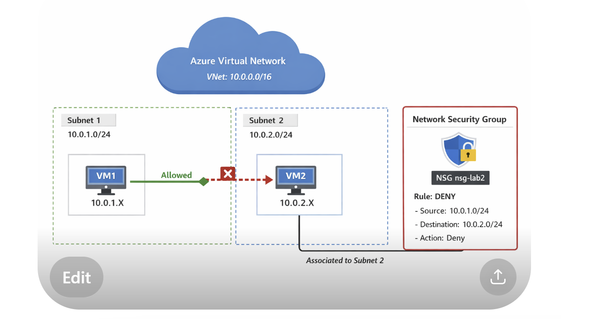

# Azure Lab 2 - Networking with Terraform

## Architecture
- VNet with 2 subnets
- 2 Linux VMs
- NSG blocking traffic between subnets

This lab demonstrates network segmentation in Azure using:

- A Virtual Network (10.0.0.0/16)
- Two subnets:
  - Subnet1 (10.0.1.0/24) → VM1
  - Subnet2 (10.0.2.0/24) → VM2
- A Network Security Group (NSG) applied to Subnet2

## Skills
- Azure Networking
- Terraform IaC
- NSG security rules

## Test
- Ping works before NSG
- Ping blocked after NSG

## Author
Henri Guillot

## 📄 Documentation
👉 [Voir le lab en PDF](docs/azure_lab_network_vm.pdf)
